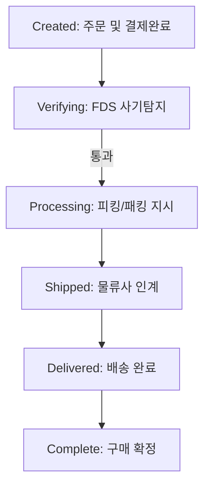

# 표준 구매 플로우 절차 (Standard Order Path)

본 문서는 고객의 상품 구매 인지부터 거래 종료(구매 확정)까지 이어지는 '골든 패스(Happy Path)' 단계와 각 단계별 시스템 데이터 상태(Status) 값의 변화 및 비즈니스 로직을 규정합니다.

---

## 단계별 프로세스 상세

### Step 1: 고객 주문 및 결제 완료
-   **시스템 상태값**: `Created`
-   **수행 주체**: 고객, OMS
-   **비즈니스 로직**: 결제 PG사 승인 확인 즉시 해당 상품의 가재고를 차감하고 고유 주문 ID를 발급합니다.

### Step 2: FDS 사기 탐지 및 심사 (Fraud Detection System)
-   **시스템 상태값**: `Verifying`
-   **수행 주체**: OMS/FDS
-   **비즈니스 로직**: 거래 패턴을 분석하여 이상 사기 패턴 탐지 시 주문을 보류하고 수동 심사로 전환합니다. 사기가 아닌 정상 주문으로 판단될 경우 다음 단계로 진행합니다.

### Step 3: 판매자 주문 확인 및 배송 준비
-   **시스템 상태값**: `Processing`
-   **수행 주체**: WMS (물류센터)
-   **비즈니스 로직**: 물류센터로 상품의 피킹(Picking) 및 패킹(Packing) 지시를 전달합니다.
-   **제약 사항**: **이 단계에 진입한 이후부터는 고객이 직접 주문을 취소하거나 정보를 수정할 수 없습니다.** (수동 취소 절차 필요)

### Step 4: 물류사 인계 및 출고
-   **시스템 상태값**: `Shipped`
-   **수행 주체**: WMS -> OMS -> 택배사
-   **비즈니스 로직**: 포장된 상품을 택배사에 인계하고 송장 번호를 발급받습니다. OMS는 고객에게 출고 완료 알림을 발송하고, 실재고를 최종 차감 처리합니다.

### Step 5: 배송 완료 및 고객 상품 수령
-   **시스템 상태값**: `Delivered`
-   **수행 주체**: 택배사 -> 고객
-   **비즈니스 로직**: 택배사 배송 완료 API 신호를 기준으로 처리됩니다. **이 시점부터 반품 및 교환 가능 기한(수령 후 7일 이내)이 카운트다운되기 시작합니다.**

### Step 6: 거래 종료 (구매 확정)
-   **시스템 상태값**: `Complete`
-   **수행 주체**: 고객, OMS
-   **비즈니스 로직**: 고객이 마이페이지에서 직접 '구매 확정'을 누르거나, 배송 완료 후 7일이 경과하면 시스템에 의해 자동 확정 처리됩니다. 구매 확정 즉시 포인트 적립 프로세스가 가동됩니다.

---
## 관련 문서
-   [고객 요청 주문 취소 절차](order_cancellation.md)
-   [포인트 제도 정책](../policies/point_policy.md)
-   [단골 고객 멤버십 정책](../policies/membership_policy.md)
