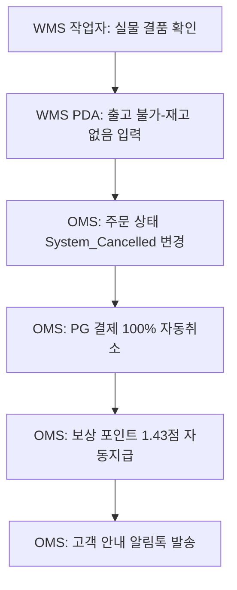

# 출고 전 결품 발생 대응 절차 (Out of Stock)

물류센터 피킹 과정에서 전산상 재고가 존재하나 실물 재고가 없어 발송이 불가능한 '시스템 예외 상황'에 대처하기 위한 운영 절차입니다.

---

## 단계별 조치 사항

### Step 1: 실물 결품 확인 및 코드 입력
-   **수행 주체**: 물류센터(WMS) 작업자
-   **조치 내용**: 피킹(Picking) 지시를 수행하던 작업자가 해당 셀(Cell)에 실물 재고가 없음을 확인하고, WMS PDA 기기에 `[출고 불가-재고 없음]` 예외 코드를 입력합니다.

### Step 2: 주문 상태 전환
-   **수행 주체**: OMS
-   **조치 내용**: WMS의 예외 신호를 수신한 OMS는 해당 주문의 상태값을 `System_Cancelled`로 자동 강제 취소 전환합니다.

### Step 3: 결제 자동 취소 및 환불
-   **수행 주체**: OMS, PG사
-   **조치 내용**: 연동된 결제 PG사를 통해 최초 결제 금액의 100%를 자동 취소 청구합니다.

### Step 4: 고객 보상 포인트 지급
-   **수행 주체**: OMS
-   **조치 내용**: 해당 품절 건은 회사 귀책 사유이므로, 취소 처리와 동시에 사과의 의미로 **보상 포인트(1.43점)**를 해당 고객 계정에 자동으로 적립 처리합니다.

### Step 5: 고객 안내 자동화
-   **수행 주체**: OMS
-   **조치 내용**: 아래 양식의 안내 알림톡을 고객에게 카카오 알림톡/SMS로 자동 발송하여 프로세스를 마무리합니다.
    -   *안내 메시지 템플릿*: `"주문하신 상품이 재고 문제로 부득이하게 취소되었습니다. 사과의 의미로 보상 포인트(1.43점)를 지급해 드렸습니다."`

---
## 관련 문서
-   [포인트 제도 정책](../policies/point_policy.md)
-   [표준 구매 플로우 절차](order_flow.md)
